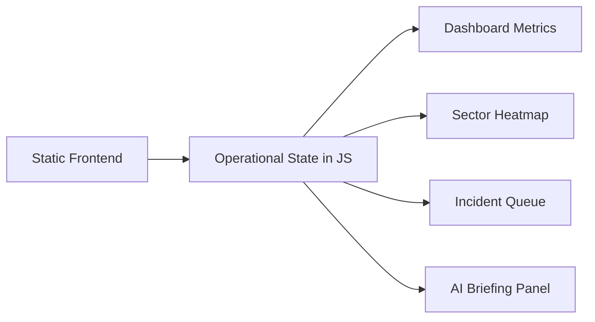
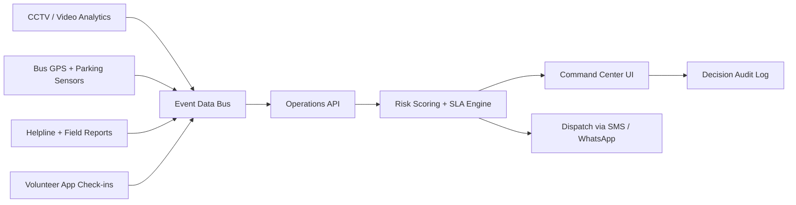

# Architecture

## Current Prototype

The Round 2 prototype is intentionally static-first. It demonstrates the command center experience without requiring live data credentials during judging.

## Production Architecture

## Data Sources

- Crowd density counters
- CCTV analytics
- GPS from buses and emergency vehicles
- Incident reports from helpline operators
- Volunteer attendance and location check-ins
- Medical post capacity
- Barricade and gate status

## AI Use

AI is used as an operations summarizer, not as an unchecked decision maker. The system should explain why it recommends an action and should keep a human officer in the approval loop for dispatch decisions.
